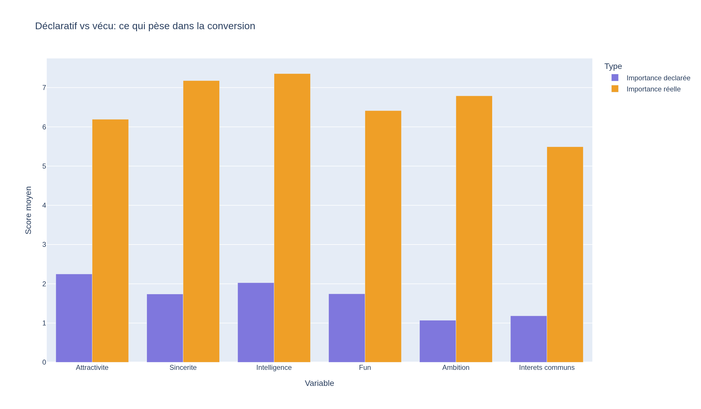
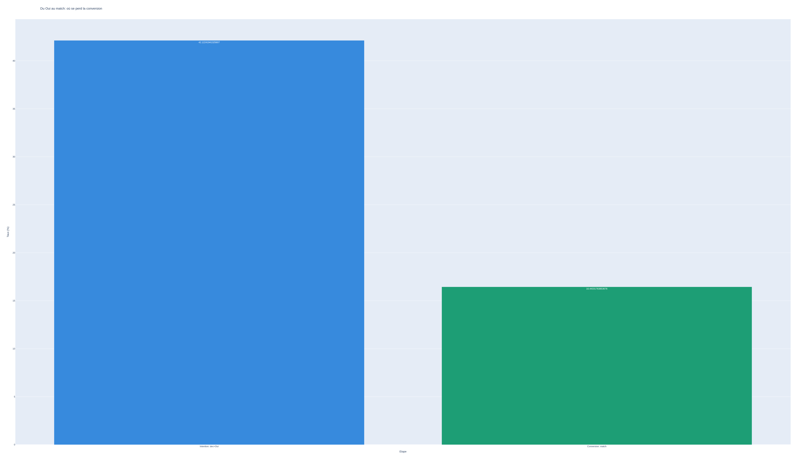
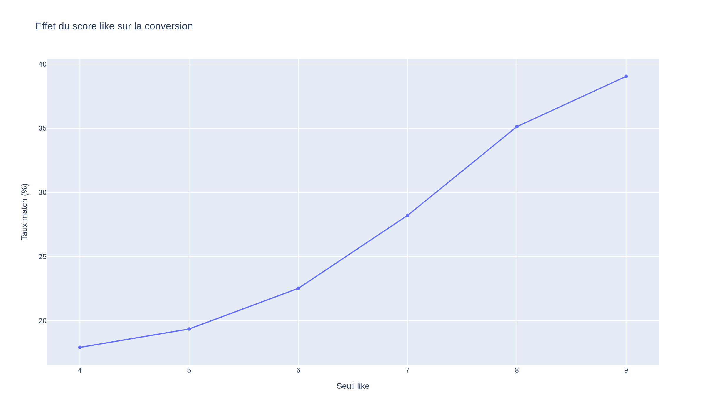

<p align="center">
  
</p>

# Projet Tinder — Speed Dating Analysis

**Bloc 2 — Exploratory Data Analysis** · Certification RNCP CDSD — Jedha

Tinder est une application de rencontre et de réseau social géolocalisé. Ce projet exploite un jeu de données de speed dating pour comprendre les facteurs qui favorisent l'intérêt mutuel entre deux personnes et augmentent la probabilité d'accepter un second rendez-vous.

---

## Objectifs

- Explorer et nettoyer un jeu de données de speed dating (~195 colonnes brutes)
- Identifier les facteurs associés au match (intérêt mutuel)
- Produire des visualisations interprétées et lisibles
- Structurer un fil narratif orienté prise de décision (data storytelling)

## Jeu de données

| Élément | Détail |
|---------|--------|
| Source | `data/speed_dating_data.csv` |
| Documentation | `data/speed_dating_data_keys.pdf` |
| Cible | `match` (intérêt mutuel) |
| Nature | Sessions de speed dating : évaluations, attributs personnels, préférences |

Après nettoyage et normalisation, les données exploitables sont exportées dans `outputs/data/df_speed_dating_cleaned.csv`.

## Structure du projet

```text
projet-tinder-bloc2/
├── data/
│   ├── speed_dating_data.csv
│   └── speed_dating_data_keys.pdf
├── notebooks/
│   ├── 01_data_exploration.ipynb
│   ├── 02_data_cleaning_norm.ipynb
│   ├── 03_full_eda.ipynb
│   └── 04_data_storytelling.ipynb
├── outputs/
│   ├── data/
│   │   ├── df_speed_dating_prep.csv
│   │   └── df_speed_dating_cleaned.csv
│   └── images/
│       ├── logo-tinder.png
│       └── viz_*.png
├── .gitignore
├── .python-version
├── pyproject.toml
├── requirements.txt
├── uv.lock
├── LICENSE
└── README.md
```

## Méthodologie

### Exploration initiale

Analyse des 195 colonnes du dataset brut, identification des valeurs manquantes et des types incohérents. Première approche statistique des distributions et des relations entre variables.

### Nettoyage et normalisation

Suppression des colonnes redondantes, traitement des valeurs manquantes, normalisation des scores. Export d'un dataset exploitable (`df_speed_dating_cleaned.csv`).

### EDA complète

Statistiques descriptives, analyse bivariée et multivariée autour de la variable `match`. Visualisations Plotly couvrant les corrélations, distributions et facteurs discriminants.

### Data storytelling

Construction d'un récit structuré autour des insights clés : quels facteurs prédisent un match, quelles différences entre les genres, comment les préférences déclarées se comparent aux choix réels. Les visuels suivent la convention `viz_<thème>_<message>.png`.

## Visualisations clés





## Installation

### Prérequis

- Python `>= 3.11`

### Avec uv (recommandé)

```bash
uv sync
```

### Avec pip

```bash
python -m venv .venv
source .venv/bin/activate
pip install -r requirements.txt
```

## Exécution

Lancer les notebooks dans l'ordre :

1. `notebooks/01_data_exploration.ipynb` — exploration initiale
2. `notebooks/02_data_cleaning_norm.ipynb` — nettoyage → `df_speed_dating_cleaned.csv`
3. `notebooks/03_full_eda.ipynb` — analyse exploratoire complète
4. `notebooks/04_data_storytelling.ipynb` — narration structurée

Chaque notebook dépend des sorties du précédent.

## Stack technique

- **Python 3.11+** · **uv**
- **Pandas** — manipulation et analyse de données
- **Plotly** — visualisations interactives
- **Kaleido** — export d'images Plotly
- **Jupyter Notebook / JupyterLab** — exécution des notebooks

## Limites et pistes d'amélioration

### Limites

- Le dataset est issu d'expériences de speed dating en laboratoire, ce qui peut différer du contexte réel d'une application comme Tinder
- Le nombre élevé de colonnes (195) rend l'exploration exhaustive difficile
- Certaines variables comportent un taux de valeurs manquantes élevé

### Pistes

- Explorer des techniques de réduction de dimensionnalité (PCA) pour mieux visualiser les groupes
- Tester des modèles de classification pour prédire le match
- Enrichir l'analyse avec des tests statistiques plus poussés

## Auteur

**RANJAKASOA Raphaël Marcellin**

Projet réalisé dans le cadre du **Bloc 2 — Exploratory Data Analysis**, certification **RNCP CDSD**, **Jedha Bootcamp**.
